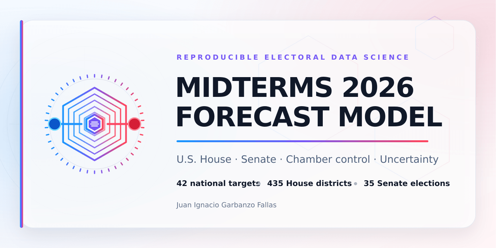
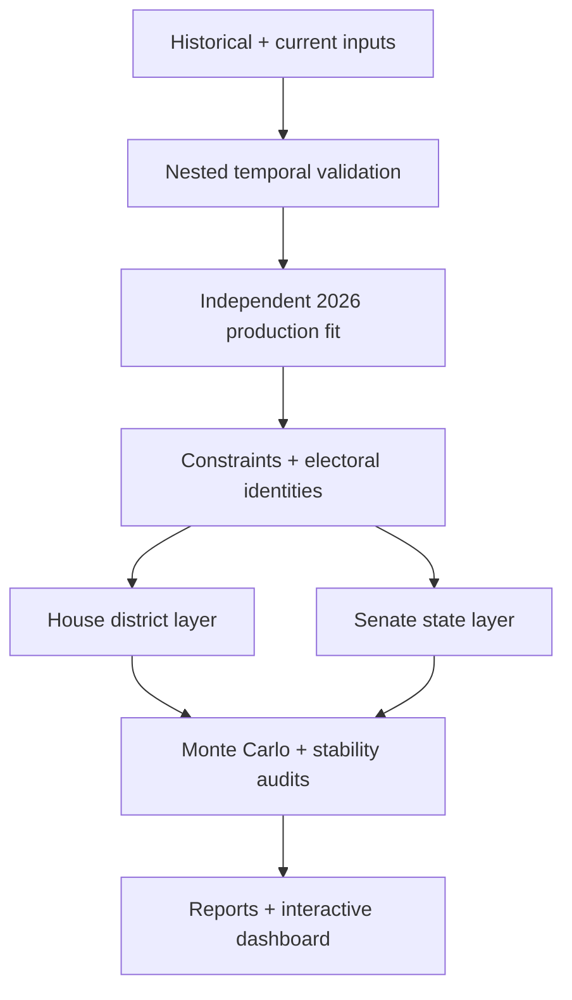
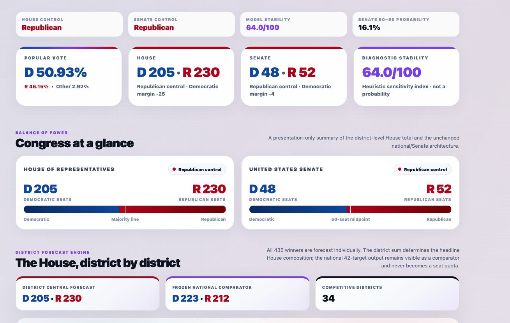
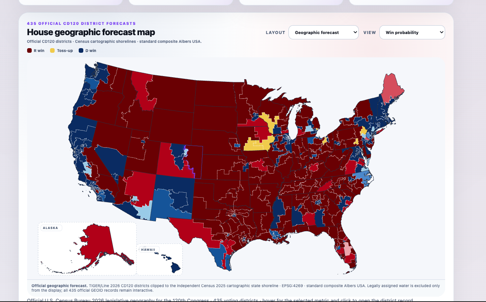
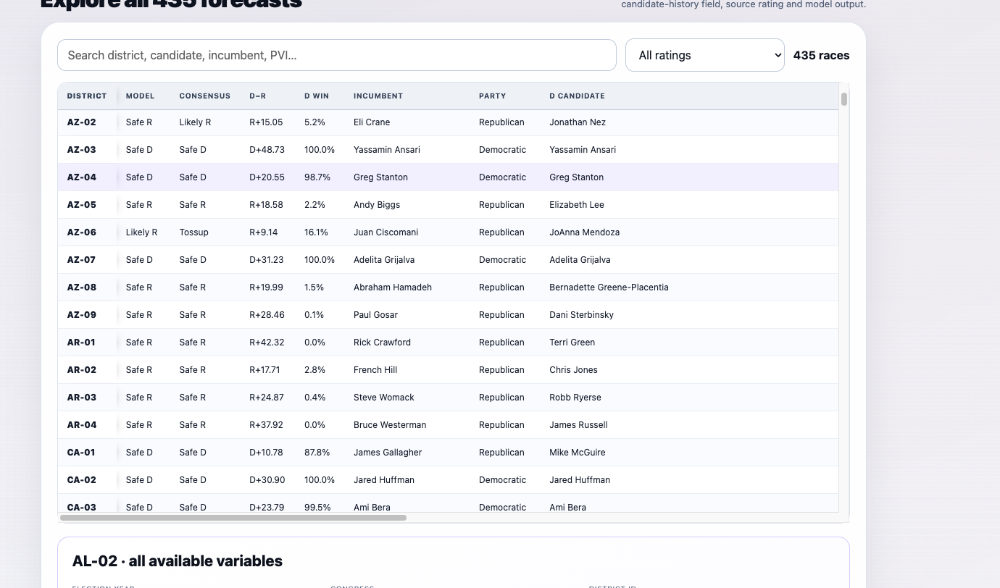
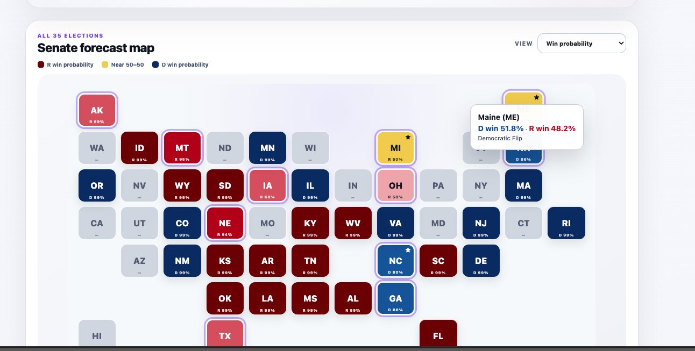
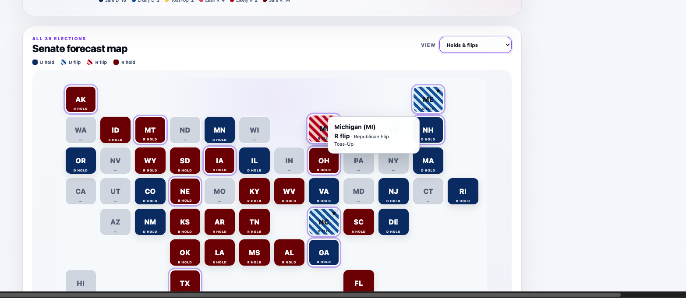

<p align="center">
  
</p>

<p align="center">
  <a href="https://github.com/juaniflls/midterms-2026-forecast/releases/latest"></a>
  
  
  
  
  
</p>

<p align="center">
  A reproducible electoral data science system for forecasting the 2026 United States midterm elections across national conditions, House districts, Senate races, chamber control, and uncertainty.
</p>

---

## Start here

| Resource | Purpose |
|---|---|
| **[Live canonical data](https://docs.google.com/spreadsheets/d/1xw1BG083q41GgdWCJ_oAbqqXQEoec5aqejzXknVqYtg/edit?usp=sharing)** | The continuously updated Google Sheet used as the current data source. |
| **[Model.xlsx](Model.xlsx)** | A versioned workbook snapshot preserved with this repository for exact reproduction and audit. |
| **[Clean notebook](Modelo_Midterms_2026_v17.ipynb)** | The executable pipeline without stored outputs. |
| **[Executed notebook](Modelo_Midterms_2026_v17_EXECUTED.ipynb)** | A validated run with its outputs preserved for inspection. |
| **[Interactive dashboard](Election_Model_2026_Dashboard_v17.html)** | A self-contained offline HTML dashboard. Download the file and open it in a modern browser. |
| **[Consolidated audit report](outputs/Election_Model_Final_Report_v17.xlsx)** | The principal machine-generated Excel report assembled by the pipeline. |
| **[Latest reproducible package](https://github.com/juaniflls/midterms-2026-forecast/releases/latest)** | The complete release bundle, including raw cartographic sources and all audit outputs. |

> [!IMPORTANT]
> The Google Sheet is the **live canonical source**. `Model.xlsx` is a frozen, versioned snapshot included so that a published release can be reproduced exactly. To update the model, export the live sheet as `Model.xlsx` without changing worksheet names or expected column positions, then run the notebook from beginning to end.

## Why this model exists

Election forecasting is often presented as one regression followed by a point estimate. This project treats forecasting as a complete data science system: historical inputs, temporally honest validation, model-family comparison, regularization, a separate production fit, electoral consistency rules, downstream House and Senate layers, Monte Carlo simulation, stability analysis, automated audits, and an interactive communication product.

The central design principle is **directional separation**. Validation folds evaluate the architecture; they do not become synthetic training observations. National estimates are frozen before state and district modules run. Senate results may consume national signals, but they do not feed back into or force the national forecast. Uncertainty quantifies the final forecast; it does not retroactively modify model training.

### What makes the system distinctive

- **42 national targets** covering the national vote and seat/rating structures used by the downstream forecast.
- **Five outer time-machine examinations**—2006, 2010, 2014, 2018, and 2022—each treated as if it had not yet occurred.
- **Nested selection inside each historical training set**, rather than tuning against the future election being evaluated.
- **Multiple model families and benchmarks**, including historical-mean baselines, regularized ridge models, tree ensembles, and an expected-vote anchor for the popular-vote component.
- **A separate production fit** trained only on the real historical observations available for the 2026 forecast.
- **Electoral identities and constraints** applied after model estimation to preserve coherent totals and relationships.
- **A downstream Senate state model** that receives frozen national information without returning information upstream.
- **A 435-district House layer** with both an official geographic map and a district cartogram.
- **Monte Carlo distributions**, control probabilities, close-race risk, and forecast-stability diagnostics.
- **One reproducible pipeline** that generates audit workbooks, the consolidated report, and the final HTML dashboard.

## Architecture



There are no backward arrows in the operational design. House and Senate projections are downstream consumers of frozen national outputs, and the communication layer never changes the trained models.

## Validation design

The national architecture is evaluated with an outer leave-one-election-out design. For each outer examination year, the held-out election is removed before inner model selection and tuning. The resulting model is then evaluated against that genuinely unseen cycle.

| Stage | Role | Information allowed |
|---|---|---|
| Outer historical examination | Measures time-machine performance and sensitivity | All eligible historical cycles except the held-out election |
| Inner selection | Selects the model family and hyperparameters | Only the outer training data |
| Outer prediction | Produces the forecast for the excluded historical election | No observed outcome from the held-out election |
| Stability analysis | Compares 2026 forecasts under historical exclusions | Predictions remain diagnostic artifacts |
| Production fit | Produces the operational 2026 forecast | Real historical observations only; no fold predictions as synthetic rows |

This structure separates two questions that are frequently conflated:

1. **How well does the architecture travel through time?**
2. **What does the model forecast when all legitimate historical information is available?**

Outer-fold predictions answer the first question. The independent production fit answers the second.

## Forecast layers

### National layer

The national layer estimates the popular-vote environment and the target structures used to produce coherent chamber-level and rating-level expectations. Candidate approaches are compared under temporal validation, and the selected production specifications are refit using all eligible historical observations.

### House layer

The House component transforms the frozen national environment and district-level inputs into forecasts for all **435 voting districts**. The dashboard offers:

- an official geographic CD120 forecast map;
- a 435-tile district cartogram;
- forecast, rating, projected-margin, and win-probability views;
- an interactive race explorer; and
- chamber-level seat and control summaries.

The geographic display uses official Census 2026 CD120 geometry, intersected with an independent 2025 Census cartographic state shoreline for display purposes. It is projected with a standard composite Albers USA layout, including Alaska and Hawaiʻi insets. No coastline or district boundary is hand-drawn.

### Senate layer

The Senate component runs after national estimates have been frozen. It evaluates the **35 scheduled 2026 Senate elections** and supports forecast, ratings, holds-and-flips, projected-margin, and win-probability views. The model displays projected two-party vote shares separately from win probabilities so that expected vote margin and outcome uncertainty are not confused.

### Uncertainty and stability

Monte Carlo simulation converts deterministic inputs and modeled uncertainty into seat distributions, chamber-control probabilities, electoral-risk summaries, and close-race diagnostics. Stability measures how strongly the forecast changes across historical exclusions; it is a robustness diagnostic, **not** another probability of winning.

## Dashboard

The dashboard is a single self-contained HTML file: it does not need a server, a map folder, or an internet connection after generation. JavaScript, styles, tabular data, the Núcleo 42 identity, and processed map paths are embedded in the output.

### National and chamber overview



### Official House geographic forecast



### House race explorer



### Senate probability and transition views

<table>
  <tr>
    <td width="50%"></td>
    <td width="50%"></td>
  </tr>
  <tr>
    <td align="center"><sub>Win probability</sub></td>
    <td align="center"><sub>Holds and flips</sub></td>
  </tr>
</table>

Screenshots are illustrative snapshots of a particular run. The current values are always determined by the latest data and execution.

## Data and provenance

| Source | Repository role |
|---|---|
| [Live model workbook](https://docs.google.com/spreadsheets/d/1xw1BG083q41GgdWCJ_oAbqqXQEoec5aqejzXknVqYtg/edit?usp=sharing) | Continuously maintained historical and current electoral inputs |
| `Model.xlsx` | Reproducible release snapshot and notebook input |
| [Census 2026 legislative geodatabase](https://www2.census.gov/geo/tiger/TGRGDB26/tlgdb_2026_us_legislative.gdb.zip) | Official congressional-district geometry for the 120th Congress |
| [Census 2025 state cartographic boundaries](https://www2.census.gov/geo/tiger/GENZ2025/shp/cb_2025_us_state_500k.zip) | Independent cartographic shoreline mask used for display |
| `assets/house_cd120_official.geojson.gz` | Auditable processed CD120 display geometry |
| `assets/house_cd120_albers_paths.json.gz` | The 435 projected SVG district paths and 50 state outlines used by the dashboard |

The raw Census archives are intentionally excluded from Git history because the legislative geodatabase exceeds GitHub's regular 100 MiB file limit. They are included in the complete release package and can also be downloaded directly from Census using the links above. Exact checksums and transformation metadata are stored in [`metadata/`](metadata/).

## Reproduce the project

### 1. Obtain the repository

Clone it with Git:

```bash
git clone https://github.com/juaniflls/midterms-2026-forecast.git
cd midterms-2026-forecast
```

Alternatively, download the latest complete package from [Releases](https://github.com/juaniflls/midterms-2026-forecast/releases/latest) and extract it without changing the folder structure.

### 2. Create the environment

Using `venv`:

```bash
python3.12 -m venv .venv
source .venv/bin/activate
python -m pip install --upgrade pip
python -m pip install -r requirements.txt
python -m ipykernel install --user --name midterms-2026-forecast
```

On Windows PowerShell, activate with:

```powershell
.venv\Scripts\Activate.ps1
```

Conda users can instead run:

```bash
conda env create -f environment.yml
conda activate modelo-midterms-2026
```

### 3. Run the model

Open `Modelo_Midterms_2026_v17.ipynb` in JupyterLab, select the new kernel, and choose **Run All Cells**. The notebook reads `Model.xlsx`, writes its audit products to `outputs/`, and regenerates `Election_Model_2026_Dashboard_v17.html`.

The same operation can be launched from a terminal:

```bash
python scripts/execute_notebook.py \
  Modelo_Midterms_2026_v17.ipynb \
  Modelo_Midterms_2026_v17_EXECUTED.ipynb
```

### 4. Rebuild the House map when needed

The processed geometry required for ordinary runs is already in `assets/`. Rebuilding it is only necessary when the official district geometry changes or when the cartographic transformation itself is being audited.

```bash
python scripts/rebuild_house_map.py --download-missing
```

This command downloads the two official Census archives if they are absent, rebuilds both processed assets, and verifies the expected 435 district paths and 50 state outlines.

### 5. Validate the repository

```bash
python scripts/validate_repository.py
```

The lightweight repository check runs automatically on GitHub Actions. The complete release bundle additionally contains all generated workbooks, source archives, checksums, and full package-level audit records.

## Repository layout

```text
.
├── README.md
├── Model.xlsx
├── Modelo_Midterms_2026_v17.ipynb
├── Modelo_Midterms_2026_v17_EXECUTED.ipynb
├── Election_Model_2026_Dashboard_v17.html
├── assets/
│   ├── branding/
│   ├── readme/
│   ├── social/
│   ├── house_cd120_official.geojson.gz
│   └── house_cd120_albers_paths.json.gz
├── data/raw/gis/README.md
├── metadata/
├── outputs/
│   └── Election_Model_Final_Report_v17.xlsx
├── qa/
├── scripts/
├── requirements.txt
└── environment.yml
```

## Verified release properties

The public release was checked for the following conditions:

- the clean notebook contains 11 code blocks and no stored execution output;
- the executed notebook completes all 11 blocks without notebook errors;
- the presentation-styled Excel workbook preserves the original worksheet names, merged ranges, formulas, values, and data logic;
- the official geographic map contains 435 unique voting districts and 50 state outlines;
- the House cartogram contains 435 district tiles;
- the Senate map contains 50 state tiles and identifies 35 elections;
- the Senate projected-margin view uses projected two-party vote share, while the probability view retains win probabilities;
- forecast, rating, margin, and holds-and-flips tooltips use party-aware styling;
- the final HTML contains valid JavaScript and the selected Núcleo 42 identity; and
- the complete raw-to-display cartographic rebuild reproduces the published processed assets.

Machine-readable evidence is available in [`qa/`](qa/).

## Interpretation and limitations

This repository produces a probabilistic forecast, not a statement of certainty. Results are conditional on the quality, timing, definitions, and availability of the input data. Historical elections are few, electoral coalitions can change, state and district environments are not independent, and late campaign events may not resemble historical variation.

Important distinctions:

- **Projected margin** is the model's expected two-party vote difference.
- **Win probability** is the simulated chance that a party finishes ahead.
- **Rating** is a categorical communication layer derived from the forecast.
- **Stability** measures sensitivity to historical exclusions and is not a win probability.
- **A dashboard snapshot** describes one execution; it is not a permanent result.

Forecasts should therefore be interpreted as structured estimates with explicit uncertainty—not as endorsements, polling replacements, or guarantees of an electoral outcome.

## Versioning and releases

The methodology described in this README is intentionally version-independent. Release-specific changes, frozen data, generated outputs, and checksums belong to tagged [GitHub Releases](https://github.com/juaniflls/midterms-2026-forecast/releases).

The first public package is tagged **`v17.0.0`**. Future versions can update data, diagnostics, or presentation without rewriting the permanent explanation of the system. See [`CHANGELOG.md`](CHANGELOG.md) and [`RELEASE_NOTES_v17.0.0.md`](RELEASE_NOTES_v17.0.0.md).

## Contributing

Methodological review, data corrections, reproducibility reports, visual improvements, and carefully scoped feature proposals are welcome.

1. Search existing issues before opening a new one.
2. Choose the appropriate issue template and provide enough evidence to reproduce the observation.
3. For code changes, create a focused branch and keep statistical logic separate from presentation-only changes whenever possible.
4. Run `python scripts/validate_repository.py` before opening a pull request.
5. Explain any implication for temporal validation, leakage risk, workbook schema, uncertainty, or downstream modules.

See [`CONTRIBUTING.md`](CONTRIBUTING.md) for the complete review workflow.

## Citation

If you use or discuss this project, cite the specific release so that the underlying data snapshot and outputs remain identifiable:

> Garbanzo Fallas, J. I. (2026). *Midterms 2026 Forecast Model* (Version 17.0.0) [Computer software]. GitHub. https://github.com/juaniflls/midterms-2026-forecast

Citation metadata is also provided in [`CITATION.cff`](CITATION.cff).

## Author and institutional context

Developed by **Juan Ignacio Garbanzo Fallas**, a member of the Observatorio de los Estados Unidos at CIEP-UCR, with interests spanning political science, economics, electoral analysis, and data science.

This repository is an independently developed technical project. Participation in the Observatory provides relevant academic context but should not be interpreted as formal institutional adoption or endorsement unless explicitly announced by the institution.

## License and responsible use

No open-source license has yet been assigned. The repository is public for technical review, reproducibility, and collaboration; permission for reuse, redistribution, or derivative publication should be obtained from the author until a license is selected. Third-party source data remain subject to their respective terms and attribution requirements.

---

<p align="center">
  <br>
  <sub>Núcleo 42 · Midterms 2026 Forecast Model</sub>
</p>
