<p align="center">
  
</p>

<p align="center">
  
  
  
  
  
  
</p>

<h1 align="center">2026 Midterm Forecast</h1>

<p align="center">
  A reproducible political data science system for forecasting the 2026 United States midterm elections—from the national environment to all 435 House districts, all 35 scheduled Senate elections, chamber control, uncertainty, and model-driven counterfactuals.
</p>

<p align="center">
  <strong>Forecast model by Juan Ignacio Garbanzo Fallas</strong><br>
  <sub>Observatorio de los Estados Unidos · CIEP-UCR</sub>
</p>

---

## Forecast snapshot

The repository contains the audited model snapshot generated on **August 26, 2026**. These are model outputs, not guarantees or institutional endorsements.

| National result | Current forecast |
|---|---:|
| Democratic popular vote | **50.93%** |
| Republican popular vote | **46.15%** |
| House | **D 224 · R 211** |
| House control probability | **D 74.6%** |
| Senate | **D 48 · R 52** |
| Senate control probability | **R 77.5%** |
| Senate 50–50 probability | **16.1%** |
| Diagnostic stability | **64.0 / 100** |

> [!NOTE]
> `64.0 / 100` is a heuristic sensitivity index, not a probability of winning. The official forecast remains the frozen baseline; Scenario Lab never overwrites it.

## See the system in motion

<p align="center">
  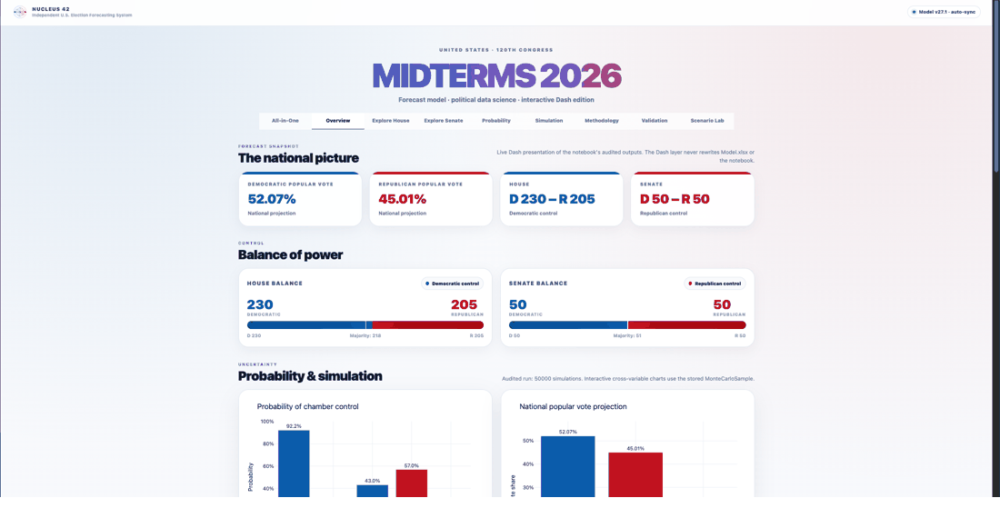
</p>

The tour moves through the national dashboard, House and Senate forecasts, and the new Scenario Lab. Every frame comes from the v26/v26.1 files included here.

## Start here

| Resource | What it provides |
|---|---|
| **[Executed notebook v26](Modelo_Midterms_2026_v26_FINAL_EJECUTADO.ipynb)** | The complete 13-code-cell modeling pipeline with stored outputs and no notebook errors. |
| **[Interactive HTML v26](Election_Model_2026_Dashboard_v26.html)** | A self-contained, offline forecast desk. Download it and open it in a modern browser. |
| **[Dash application v26.1](dash_app/)** | The live interactive presentation layer, including Scenario Lab, responsive controls, maps, hovers, holds, and flips. |
| **[Consolidated report v26](outputs/Election_Model_Final_Report_v26.xlsx)** | The principal machine-generated audit workbook used by Dash. |
| **[Frozen model workbook](Model.xlsx)** | The versioned input snapshot required to reproduce this release. |
| **[Live canonical data](https://docs.google.com/spreadsheets/d/1xw1BG083q41GgdWCJ_oAbqqXQEoec5aqejzXknVqYtg/edit?usp=sharing)** | The continuously maintained Google Sheet. Export it as `Model.xlsx` before a future model run. |
| **[Scenario Lab methodology](docs/SCENARIO_LAB.md)** | Hard constraints, learned cross-unit reconciliation, baseline identity, geographic translation, and limitations. |
| **[Technical methodology](docs/METHODOLOGY.md)** | Temporal validation, national model, House, Senate, uncertainty, and audit design. |
| **[Publishing guide](docs/PUBLISHING.md)** | Safe replacement, validation, commit, push, and automated GitHub checks. |

> [!IMPORTANT]
> `Model.xlsx`, the v26 report, the v26 runtime, and the v26 HTML belong to one frozen snapshot. Do not mix them with files from another model run. `dash_app/check_setup.py` verifies that contract before launch.

## What is new in v26.1

Version 26 introduces the fourteen-unit counterfactual premodel. Version 26.1 preserves that exact model and upgrades only the Dash presentation layer.

- **Outcome-first Scenario Lab:** national vote and seat results appear first, followed by compact horizontal intervention batteries and full-width House and Senate maps.
- **Fourteen intervention units:** twelve mutually exclusive response batteries plus unemployment and inflation as independent macroeconomic controls.
- **Thirty-one reconciled national controls:** edits propagate across units through regularized historical associations, not partisan intuition.
- **Same 42-target model:** every released intervention reruns the central model and both geographic translators.
- **Exact baseline identity:** reset reproduces D 50.93% / R 46.15%, House 224–211, and Senate 48–52.
- **Projected vote maps:** the Scenario House map uses projected two-party vote and a blue-to-red margin scale—no yellow close-race layer.
- **Correct holds and flips:** Senate outcomes compare the projected winner with the incumbent party; Maine, Michigan, and North Carolina are no longer mislabeled as universal holds.
- **Structured Senate hover:** projected vote, margin, probability, rating, incumbent party, hold/flip status, and change from the official forecast are available in the live Dash.
- **No artificial Safe margin:** the 24 unmonitored Safe Senate races remain categorical in the official forecast. Structural proxies are used only inside Scenario Lab and are labeled accordingly.
- **Presentation/model separation:** v26.1 changes layout, labels, color logic, tooltips, and display classification; it does not change a model coefficient, forecast probability, vote share, or official seat total.

See [`CHANGELOG.md`](CHANGELOG.md) and [`RELEASE_NOTES_v26.1.0.md`](RELEASE_NOTES_v26.1.0.md) for the release record.

## Scenario Lab

Scenario Lab is a counterfactual interface over the same audited forecast—not a second forecast and not a collection of independent sliders.

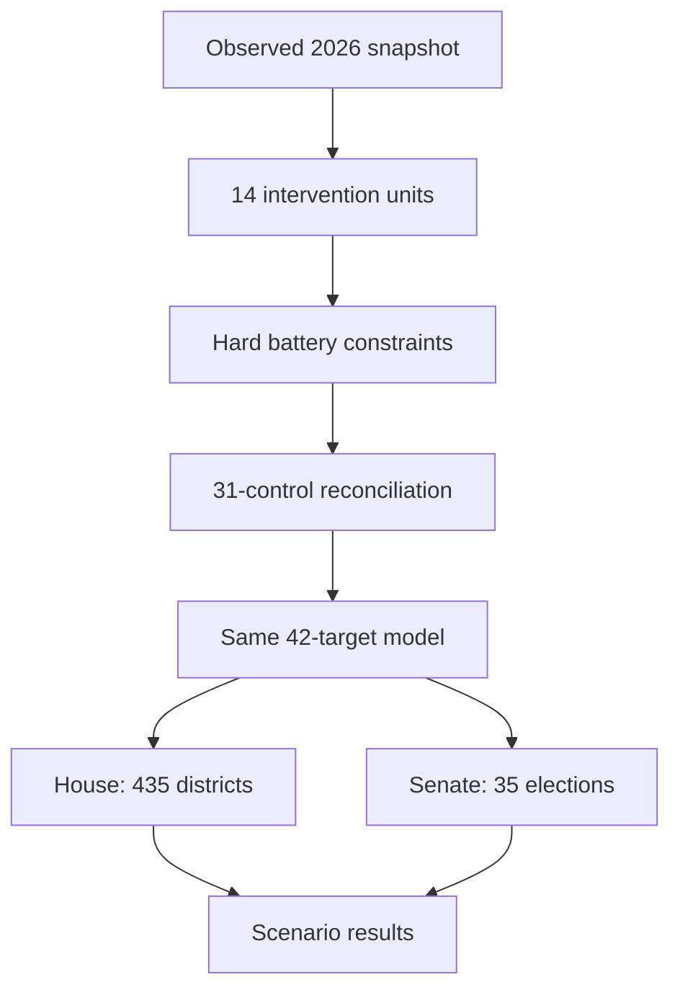

When all sliders remain at their observed values, Scenario Lab is exactly equal to the official forecast. When the user edits a control:

1. the edited response battery is projected into its mathematically feasible region;
2. the latest direct edit receives priority if same-battery requests conflict;
3. cross-unit relationships reconcile the other national controls;
4. the same central 42-target model runs again; and
5. the reconciled national signal moves through the House district and Senate state layers.

The learned relationship system uses Ledoit–Wolf shrinkage, leave-one-election-year-out sign reliability, and bounded propagation. Statistical influence inside a battery is zero by design; components move together only because of the hard composition constraint. The system is **associational and non-causal**.

<p align="center">
  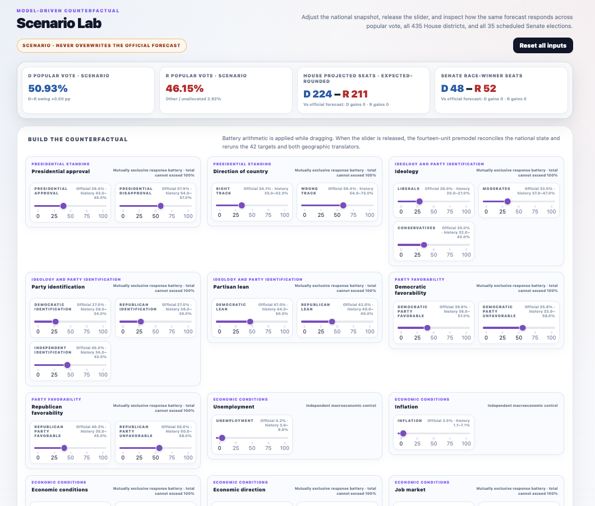
</p>

<table>
  <tr>
    <td width="50%">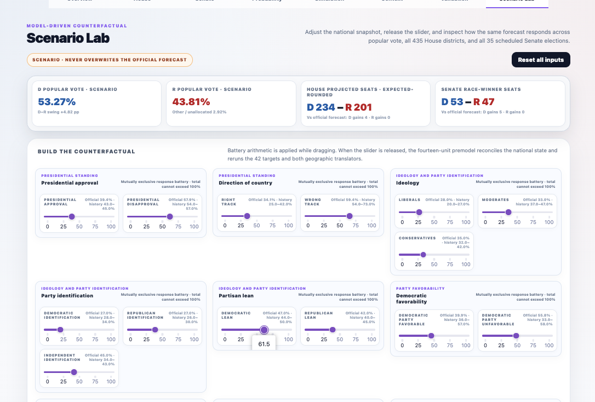</td>
    <td width="50%">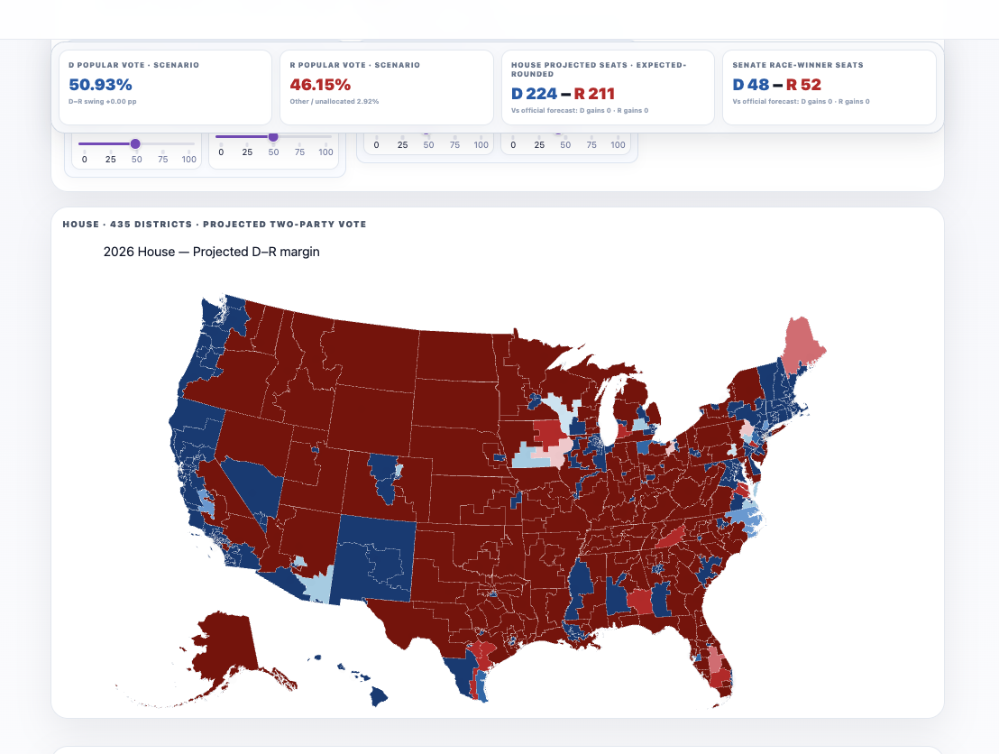</td>
  </tr>
  <tr>
    <td align="center"><sub>A live counterfactual with changed vote and seats</sub></td>
    <td align="center"><sub>All 435 districts translated through the geographic layer</sub></td>
  </tr>
</table>

## Forecast architecture

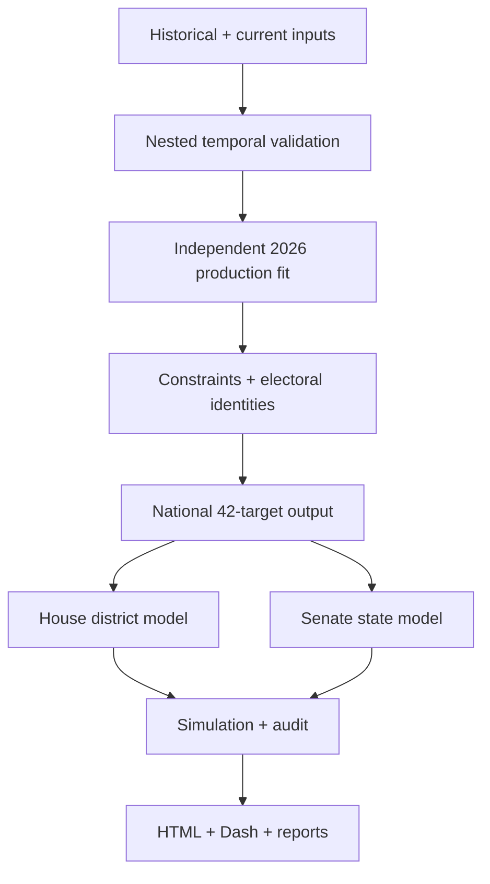

The production design is directional. Historical tests evaluate the architecture but never become synthetic training observations. National estimates are frozen before the House and Senate modules run. The presentation layers consume outputs and never write back to `Model.xlsx`, the notebook, or the forecast report.

### National layer

- 42 national targets spanning popular vote and the chamber/rating structures required downstream.
- Competing model families and benchmarks selected under nested temporal validation.
- Independent 2026 production fit trained only on legitimate historical observations.
- Electoral identities and constraints applied after estimation.

### House layer

- All **435 voting districts** using official CD120 geography.
- Geographic forecast and district cartogram.
- Forecast, rating, projected margin, win probability, and holds/flips views.
- Searchable district-level race explorer and chamber-control simulation.

### Senate layer

- All **35 scheduled regular and special elections** in 2026.
- Eleven monitored races with numerical state-model estimates.
- Twenty-four unmonitored Safe races retained as categorical official ratings.
- Separate projected two-party vote, projected margin, win probability, rating, and hold/flip concepts.

### Uncertainty and validation

- **50,000 Monte Carlo simulations** for chamber-control distributions.
- Five sealed time-machine elections: 2006, 2010, 2014, 2018, and 2022.
- Nested model selection inside each historical training set.
- Stability, sensitivity, close-race risk, and consistency audits.

## Historical validation design

| Stage | Purpose | Information allowed |
|---|---|---|
| Outer election test | Measures time-machine performance | All eligible cycles except the held-out election |
| Inner selection | Selects model family and hyperparameters | Only the outer training data |
| Outer prediction | Forecasts the excluded historical election | No observed outcome from the held-out cycle |
| Stability analysis | Tests 2026 sensitivity to historical exclusions | Diagnostic forecasts only |
| Production fit | Generates the operational 2026 snapshot | Real historical observations only |

This separates two different questions: how well the architecture travels through time, and what it forecasts when all legitimate historical information is available.

## Visual tour

### Autonomous HTML forecast desk

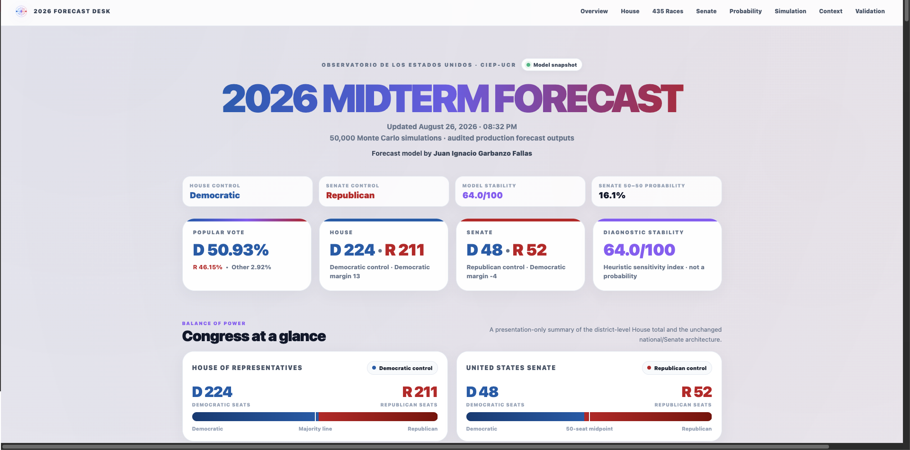

<table>
  <tr>
    <td width="50%">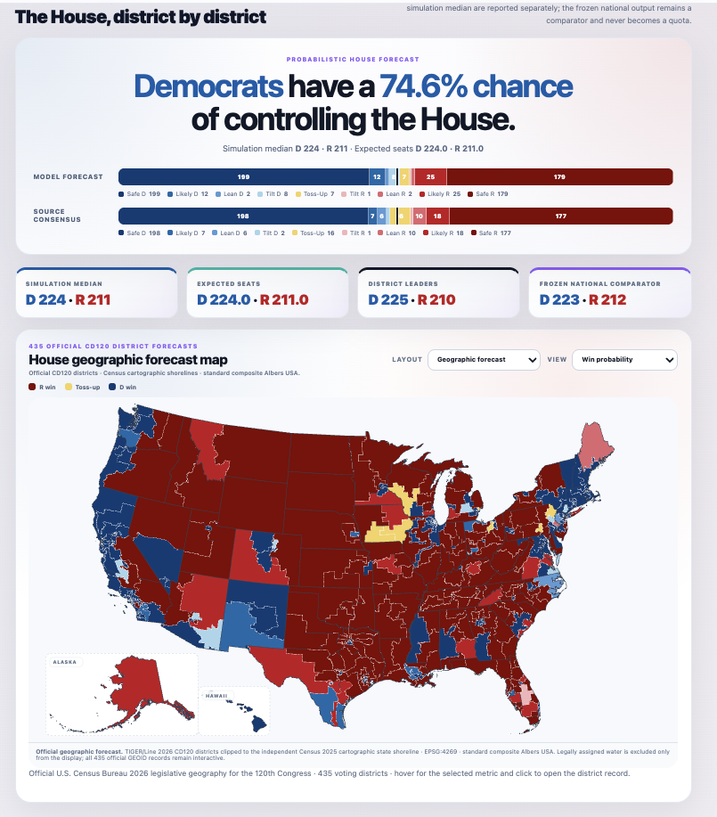</td>
    <td width="50%">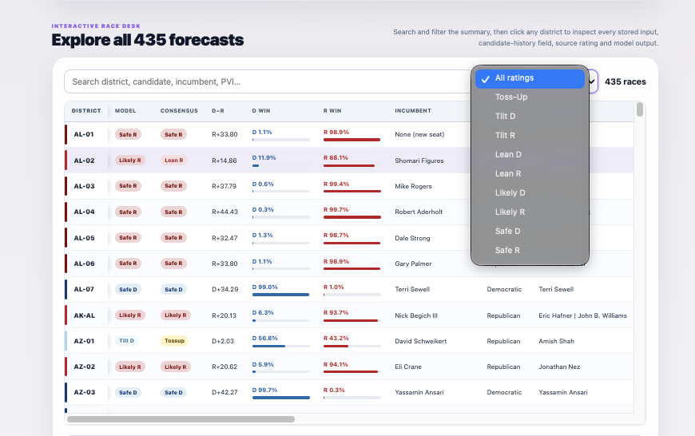</td>
  </tr>
  <tr>
    <td align="center"><sub>House control and official CD120 geography</sub></td>
    <td align="center"><sub>Searchable records for all 435 races</sub></td>
  </tr>
</table>

<table>
  <tr>
    <td width="50%">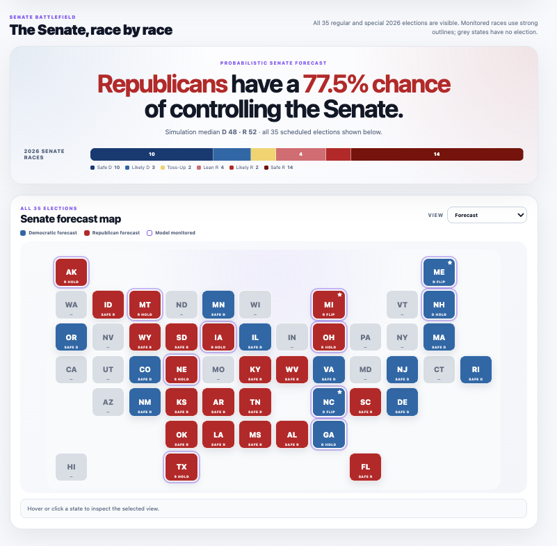</td>
    <td width="50%">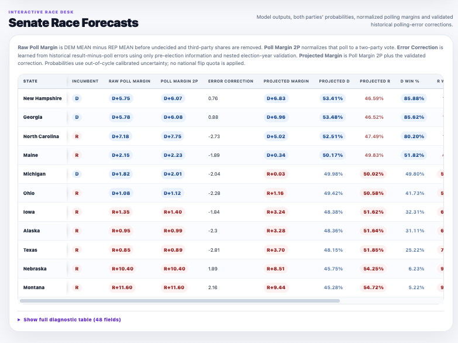</td>
  </tr>
  <tr>
    <td align="center"><sub>Control probability and all 35 scheduled elections</sub></td>
    <td align="center"><sub>Projected vote, margins, probability, and diagnostics</sub></td>
  </tr>
</table>

### Live Dash presentation

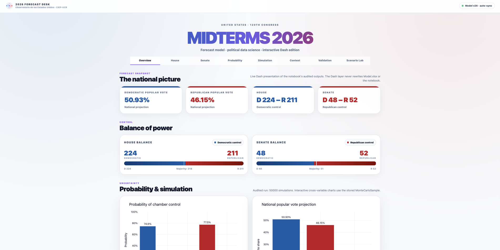

<table>
  <tr>
    <td width="50%">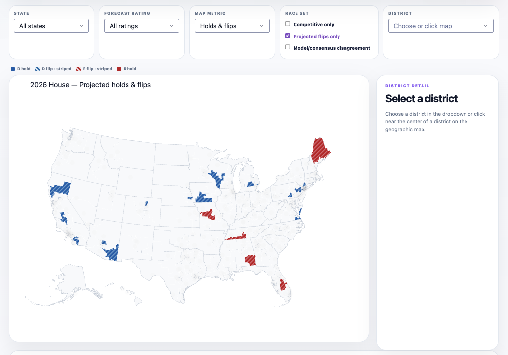</td>
    <td width="50%">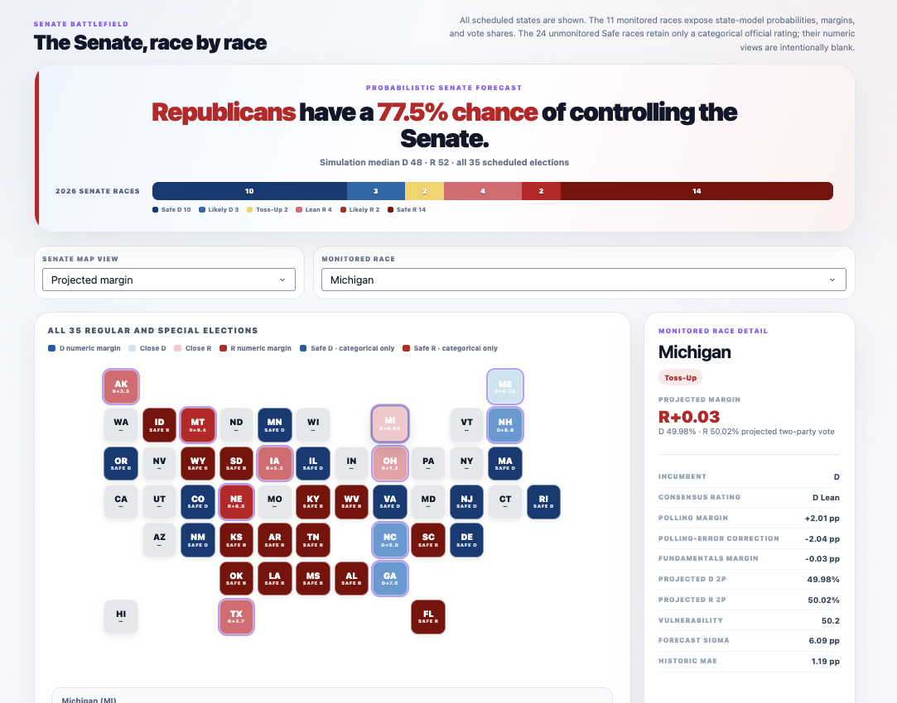</td>
  </tr>
  <tr>
    <td align="center"><sub>House holds and flips with district detail</sub></td>
    <td align="center"><sub>Senate control, vote, margin, and race detail</sub></td>
  </tr>
</table>

<details>
<summary><strong>Open the complete fourteen-image release gallery</strong></summary>

#### HTML: national context

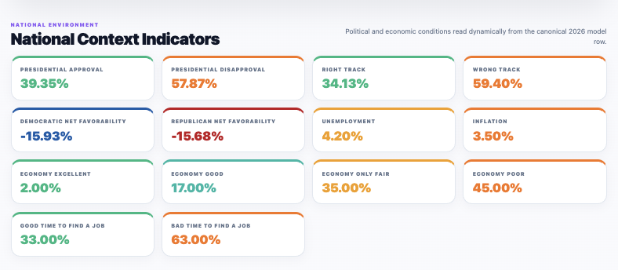

#### HTML: time-machine validation

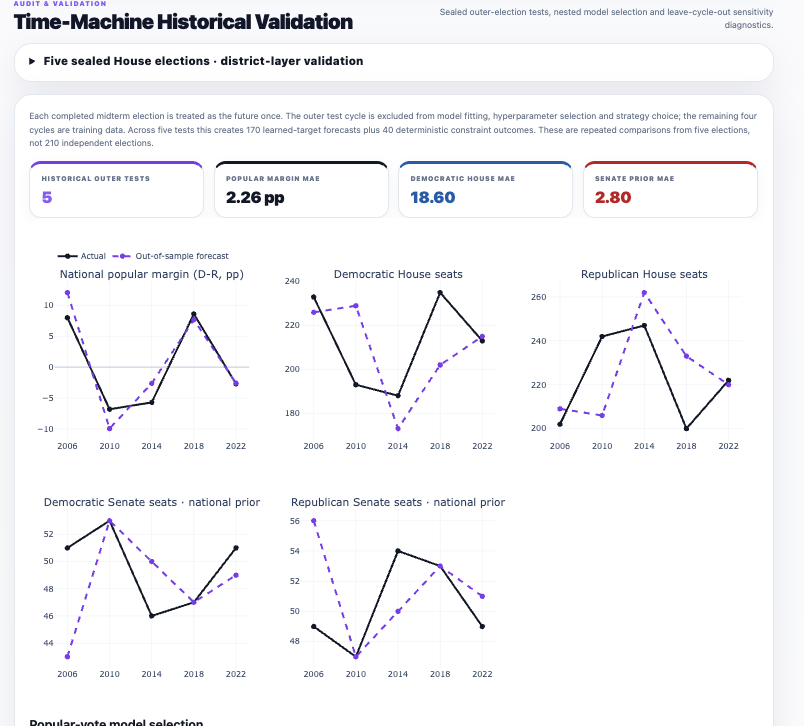

#### Scenario Lab: complete control grid

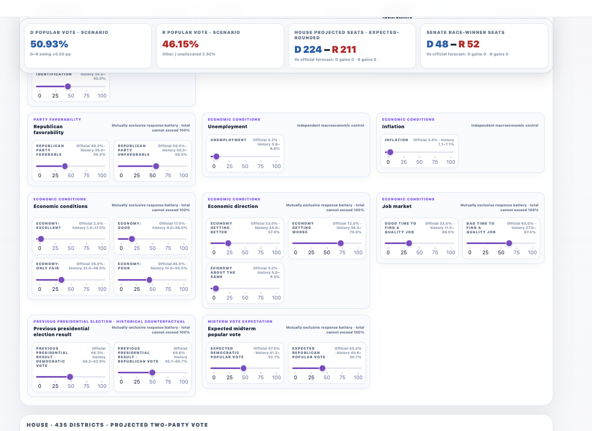

The remaining eleven release images appear in the main sections above. All fourteen original captures are preserved in [`assets/readme/`](assets/readme/).

</details>

## Run the project

### Option A — open the autonomous HTML

Download [`Election_Model_2026_Dashboard_v26.html`](Election_Model_2026_Dashboard_v26.html) and open it in Safari, Chrome, Firefox, or Edge. It is self-contained and does not require a server after generation.

### Option B — run the live Dash app

From the repository root:

```bash
cd dash_app
python3 -m venv .venv
source .venv/bin/activate
python3 -m pip install --upgrade pip
python3 -m pip install --no-cache-dir -r requirements.txt
python3 check_setup.py
python3 app.py
```

Open `http://127.0.0.1:8050`. Stop the server with `Control + C`. If port 8050 is occupied:

```bash
DASH_PORT=8051 python3 app.py
```

> [!TIP]
> If a folder was replaced while Terminal was still inside it, first run `cd /`, then `cd` into the new repository path. This prevents a stale working-directory error on macOS.

### Option C — reproduce the full notebook

The model environment and Dash environment are intentionally separate because the executed notebook preserves its own pinned scientific stack while Dash uses a newer interactive stack.

```bash
python3.12 -m venv .venv-model
source .venv-model/bin/activate
python3 -m pip install --upgrade pip
python3 -m pip install -r requirements.txt
jupyter lab Modelo_Midterms_2026_v26_FINAL_EJECUTADO.ipynb
```

Choose **Restart Kernel and Run All Cells**. The notebook reads `Model.xlsx`, regenerates the v26 report and scenario runtime under `outputs/`, and rewrites the self-contained v26 HTML.

To execute from Terminal and write a separate verification copy:

```bash
python3 scripts/execute_notebook.py \
  Modelo_Midterms_2026_v26_FINAL_EJECUTADO.ipynb \
  Modelo_Midterms_2026_v26_VERIFIED.ipynb
```

## Repository layout

```text
.
├── README.md
├── Model.xlsx
├── Modelo_Midterms_2026_v26_FINAL_EJECUTADO.ipynb
├── Election_Model_2026_Dashboard_v26.html
├── dash_app/
│   ├── app.py
│   ├── core.py
│   ├── figures.py
│   ├── scenario_engine.py
│   ├── views.py
│   ├── check_setup.py
│   └── assets/dash_v2.css
├── outputs/
│   ├── Election_Model_Final_Report_v26.xlsx
│   ├── Model_Sensitivity_Audit_v26.xlsx
│   ├── scenario_state_engine_v26.py
│   └── block-level audit workbooks
├── assets/
│   ├── branding/
│   ├── readme/
│   ├── social/
│   ├── house_cd120_official.geojson.gz
│   └── house_cd120_albers_paths.json.gz
├── docs/
├── metadata/
├── qa/
├── scripts/
├── requirements.txt
└── environment.yml
```

## Data and cartographic provenance

| Source | Repository role |
|---|---|
| [Live model workbook](https://docs.google.com/spreadsheets/d/1xw1BG083q41GgdWCJ_oAbqqXQEoec5aqejzXknVqYtg/edit?usp=sharing) | Maintained historical and current electoral inputs |
| `Model.xlsx` | Frozen release snapshot and notebook input |
| [Census 2026 legislative geodatabase](https://www2.census.gov/geo/tiger/TGRGDB26/tlgdb_2026_us_legislative.gdb.zip) | Official congressional-district geometry for the 120th Congress |
| [Census 2025 state cartographic boundaries](https://www2.census.gov/geo/tiger/GENZ2025/shp/cb_2025_us_state_500k.zip) | Independent shoreline mask for presentation |
| `assets/house_cd120_official.geojson.gz` | Processed auditable CD120 display geometry |
| `assets/house_cd120_albers_paths.json.gz` | 435 projected district paths and 50 state outlines |

Raw Census archives exceed normal GitHub file-size limits and are not committed. They remain available from Census; checksums and transformation metadata are preserved in [`metadata/`](metadata/) and [`qa/`](qa/).

## Validation contracts

Run the repository and Dash checks before committing a new model snapshot:

```bash
python3 scripts/validate_repository.py
cd dash_app
python3 check_setup.py
```

The current package verifies:

- 13 executed notebook code cells and zero stored notebook errors;
- 435 unique House district paths and 50 state outlines;
- 50 Senate tiles representing 35 scheduled elections;
- exact Scenario Lab baseline identity;
- 14 intervention units, 12 composition batteries, and 31 controls;
- 182 directed unit relationships and 930 directed control relationships;
- zero within-battery statistical weights;
- House 224–211 and Senate 48–52 at reset;
- corrected Senate hold/flip classification;
- no cache, environment, checkpoint, macOS metadata, or embedded Git history in the public package; and
- no tracked file above GitHub’s 100 MiB limit.

Automated repository and Dash validation also runs on pushes and pull requests through GitHub Actions.

## Interpretation and limitations

This is a probabilistic research model. Results depend on the quality, timing, definitions, and availability of the input data. Historical midterm elections are few, coalitions can change, districts and states are not independent, and late events may fall outside historical support.

- **Projected vote** is an expected two-party vote share.
- **Projected margin** is the difference between the projected D and R vote shares.
- **Win probability** is the simulated chance that a party finishes ahead.
- **Rating** is a categorical communication layer.
- **Stability** measures sensitivity; it is not a win probability.
- **Scenario Lab** explores conditional counterfactuals; it does not make causal claims.
- **Extreme slider values** are extrapolations and should be interpreted with extra caution.
- **National chamber buckets** remain available as 42-target diagnostics, while final scenario seat totals are governed by the district and state geographic layers.
- **A snapshot** describes one execution and will change when the canonical data are updated and the pipeline is rerun.

## Citation

Please cite the specific release so the frozen data and outputs remain identifiable:

> Garbanzo Fallas, J. I. (2026). *Midterms 2026 Forecast Model* (Version 26.1.0) [Computer software]. GitHub. https://github.com/juaniflls/midterms-2026-forecast

Machine-readable metadata is provided in [`CITATION.cff`](CITATION.cff).

## Author and institutional context

Developed by **Juan Ignacio Garbanzo Fallas**, a member of the Observatorio de los Estados Unidos at CIEP-UCR, with work spanning political science, economics, electoral analysis, and data science.

This is an independently developed technical project. Participation in the Observatory provides academic context but does not imply formal institutional adoption or endorsement unless explicitly announced by the institution.

## License and responsible use

Original software and documentation are licensed under the [MIT License](LICENSE), Copyright © 2026 Juan Ignacio Garbanzo Fallas.

The MIT License does not relicense third-party datasets, Census materials, software dependencies, institutional names or marks, or other external resources. Forecasts are provided without warranty. Scholarly, journalistic, or public use should preserve the methodological context and must not imply endorsement by CIEP-UCR, the Observatorio de los Estados Unidos, or any other institution.

---

<p align="center">
  <br>
  <sub>Midterms 2026 Forecast · Political data science · Model v26 · Dash v26.1</sub>
</p>
