<p align="center">
  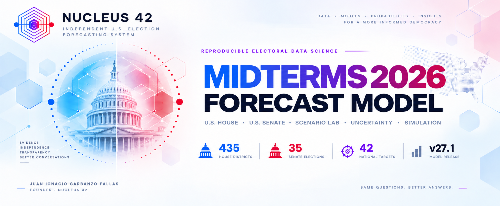
</p>

<p align="center">
  
  
  
  
  
  
  
</p>

<h1 align="center">NUCLEUS 42 · 2026 U.S. Midterm Forecast</h1>

<p align="center">
  <strong>Independent U.S. Election Forecasting System</strong><br>
  Reproducible electoral data science for the national environment, all 435 House districts, all 35 scheduled Senate elections, uncertainty, validation, and interactive counterfactuals.
</p>

<p align="center">
  <strong>Forecast model by Juan Ignacio Garbanzo Fallas</strong><br>
  <sub>NUCLEUS 42 · evidence · independence · transparency · better conversations</sub>
</p>

---

## Forecast snapshot · v27.1

Frozen production snapshot: **September 8, 2026**.

| Measure | Official v27.1 output |
|---|---:|
| Democratic popular vote | **52.07%** |
| Republican popular vote | **45.01%** |
| Other / unallocated | **2.92%** |
| House | **D 230 · R 205** |
| House control probability | **D 92.2%** |
| House flips | **23 R→D · 8 D→R · net D +15** |
| Senate | **D 50 · R 50** |
| Senate control probability | **R 57.0%** |
| Senate 50–50 probability | **20.2%** |
| Senate flips | **3 R→D · 0 D→R · net D +3** |
| Monte Carlo | **50,000 complete election simulations** |
| National outputs | **42 targets** |
| Diagnostic stability | **70.0/100** *(heuristic sensitivity index, not a win probability)* |

> [!IMPORTANT]
> **There is one official central forecast per chamber.** House and Senate are built from individual race engines, complete-election simulations, a modal chamber total, and one coherent central map within that total. Control probability and interval summaries come from the full distribution and never replace the central forecast.

## See NUCLEUS 42 in motion

<p align="center">
  
</p>

---

## Start here

| Resource | What it provides |
|---|---|
| **[Executed notebook v27.1](Modelo_Midterms_2026_v27.1_NUCLEUS42_FINAL.ipynb)** | Complete 13-code-cell production pipeline with stored outputs and no notebook errors. |
| **[Self-contained HTML](Election_Model_v27_1_Coherence_Audit.html)** | Offline NUCLEUS 42 forecast desk generated by Block 8. |
| **[Dash application](dash_app/)** | All-in-One, Overview, Explore House, Explore Senate, Probability, Simulation, Methodology, Validation, and Scenario Lab. |
| **[Consolidated report](outputs/Election_Model_Final_Report_v27_1.xlsx)** | Primary machine-generated audit workbook and Dash data contract. |
| **[Frozen model workbook](Model.xlsx)** | Exact workbook snapshot used by this release. |
| **[Live canonical Model sheet](https://docs.google.com/spreadsheets/d/1NC80MaJh8vyxrbQsi__HSR2StaSo8mgAJ3iSdilqEj0/edit?usp=sharing)** | Maintained Google Sheet. Export as `Model.xlsx` before a future production run. |
| **[Methodology](docs/METHODOLOGY.md)** | Central forecast contract, House, Senate, simulation, validation, and reproducibility. |
| **[Scenario Lab](docs/SCENARIO_LAB.md)** | Counterfactual controls, constraints, historical reconciliation, geography, and limits. |
| **[Model card](MODEL_CARD.md)** | Intended use, outputs, validation design, limitations, and interpretation. |
| **[Publishing guide](docs/PUBLISHING.md)** | Replace, validate, commit, push, and release checklist. |

> [!WARNING]
> `Model.xlsx`, the executed notebook, final HTML, final report, and scenario runtime belong to **one frozen snapshot**. Do not mix artifacts from different runs.

---

## What is new in v27.1

### House · all 435 districts

- Correct 2024 baseline: **D215 · R220**.
- 2024→2026 district lineage / crosswalk auditing.
- Every Monte Carlo draw simulates all **435 districts individually**.
- Official central House: **D230 · R205**.
- Exact seat changes: **23 R→D**, **8 D→R**, **net D +15**.
- Canonical v27 source consensus for all 435 districts.
- Geographic forecast map, equal-seat cartogram, searchable race explorer, PVI/rank audit, ratings, margins, probabilities, and holds/flips.
- Cook PVI 2026 and 2026 Rank are current-cycle structural information, not synthetic historical rows.

### Senate · one coherent central forecast

- All **35 scheduled 2026 elections** are displayed.
- **11 monitored races** receive numerical state-model outputs; **24 Safe races** remain categorical officially.
- Each Monte Carlo draw simulates all 11 monitored races before fixed/Safe seats are added.
- Official central Senate: **D50 · R50**.
- Central D flips: **North Carolina, Ohio, Maine**.
- Full-distribution Republican control probability: **57.0%**.
- Exact 50–50 probability: **20.2%**.
- Public monitored-race margin, probability, winner, vote share, and rating are reconciled to the same central state.

### Central-forecast coherence

The public system separates:

1. race-level forecasts;
2. one official central chamber composition;
3. full Monte Carlo uncertainty diagnostics; and
4. Scenario Lab counterfactuals.

House and Senate random streams are independent. A central row in one chamber is never paired to the other chamber by shared simulation index.

### Scenario Lab

Scenario Lab remains a **separate counterfactual engine**, not a second forecast.

- **31 controls**
- **14 intervention units**
- **12 constrained composition batteries**
- **42 downstream national targets**
- **435 House districts**
- **35 Senate elections**
- exact reset identity to the official v27.1 forecast
- latest-edit priority inside incompatible batteries
- compatible cross-battery interventions preserved
- regularized historical cross-unit reconciliation

Reset returns exactly:

```text
Popular vote: D 52.07% · R 45.01% · Other 2.92%
House:        D 230 · R 205
Senate:       D 50  · R 50
```

---

## Forecast architecture

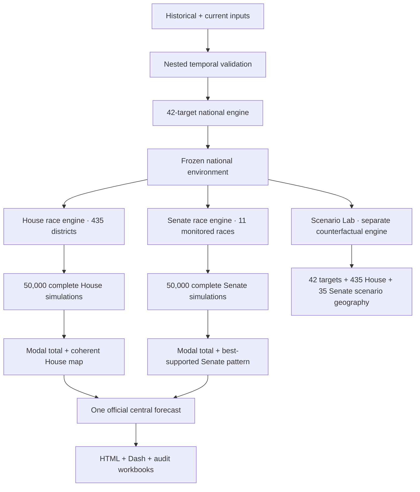

Presentation is downstream and read-only.

---

## House · district by district

<p align="center">
  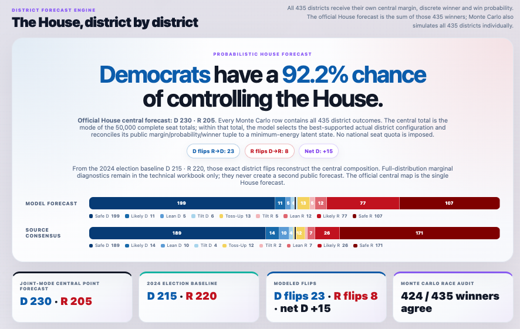
</p>

<table>
<tr>
<td width="50%"></td>
<td width="50%">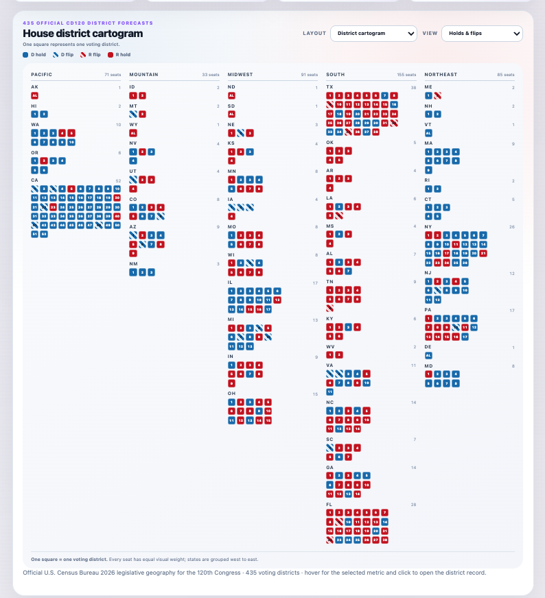</td>
</tr>
<tr>
<td align="center"><sub>Official CD120 geographic forecast</sub></td>
<td align="center"><sub>Equal-seat cartogram</sub></td>
</tr>
</table>

<p align="center">
  
</p>

Every voting district has its own central margin, discrete winner, probability, model rating, source consensus, 2024 baseline, and hold/flip classification.

---

## Senate · race by race

<table>
<tr>
<td width="50%"></td>
<td width="50%"></td>
</tr>
<tr>
<td align="center"><sub>Central 50–50 Senate forecast and map</sub></td>
<td align="center"><sub>Monitored margins, probabilities, and winners</sub></td>
</tr>
</table>

The Senate public surface distinguishes the official central map from full-distribution uncertainty.

---

## Monte Carlo & uncertainty

<p align="center">
  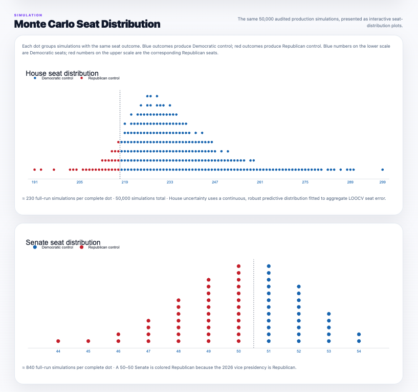
</p>

The production run uses **50,000 complete election simulations** to generate seat distributions, control probabilities, close-race risk, uncertainty intervals, Senate 50–50 probability, and central-pattern support.

Monte Carlo propagates uncertainty. It does not refit the model.

---

## Interactive Dash

<table>
<tr>
<td width="50%"></td>
<td width="50%">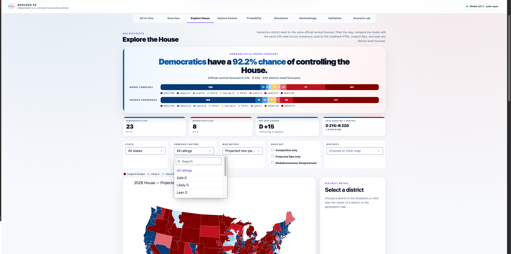</td>
</tr>
<tr>
<td align="center"><sub>Overview · national picture and balance of power</sub></td>
<td align="center"><sub>Explore House · map, filters, source consensus, flips, district detail</sub></td>
</tr>
<tr>
<td width="50%">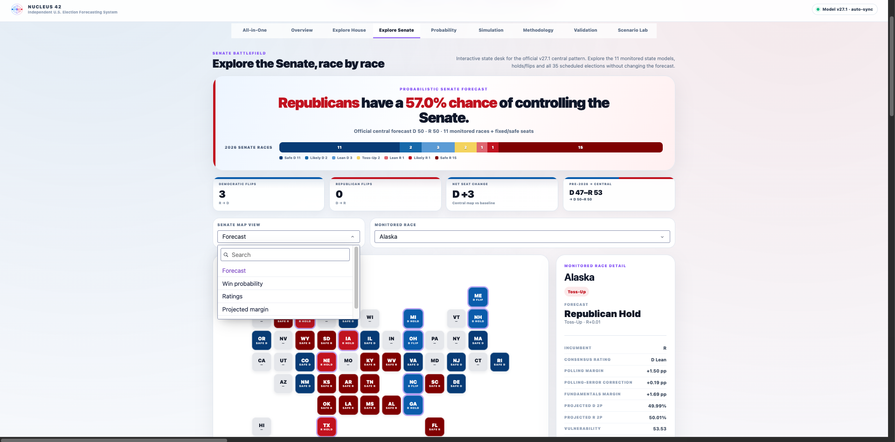</td>
<td width="50%">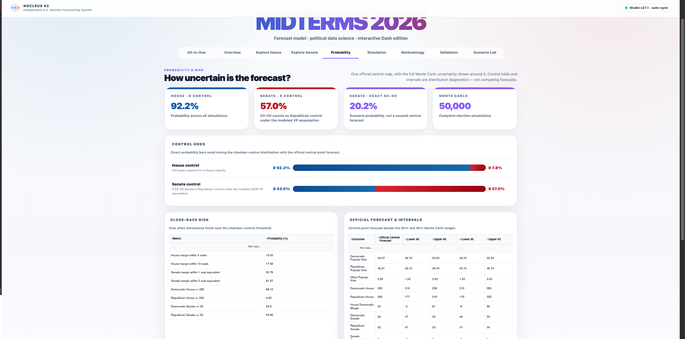</td>
</tr>
<tr>
<td align="center"><sub>Explore Senate · all 35 elections + monitored race detail</sub></td>
<td align="center"><sub>Probability · control odds, risk, and intervals</sub></td>
</tr>
<tr>
<td width="50%">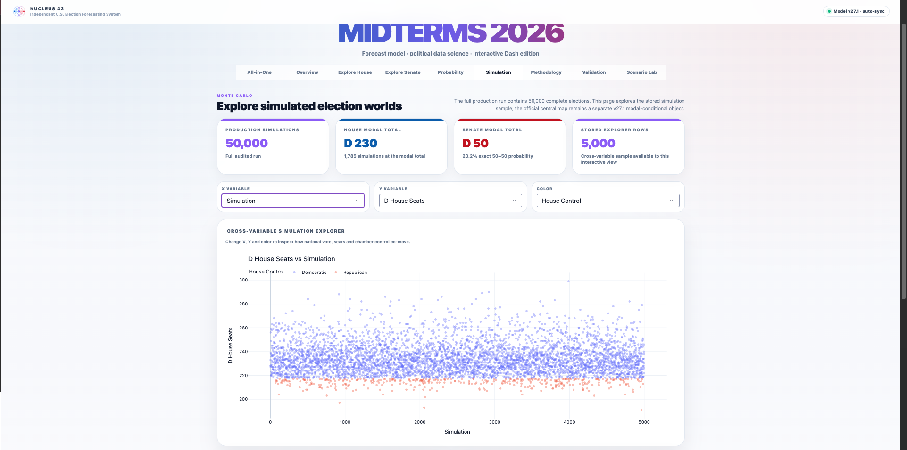</td>
<td width="50%">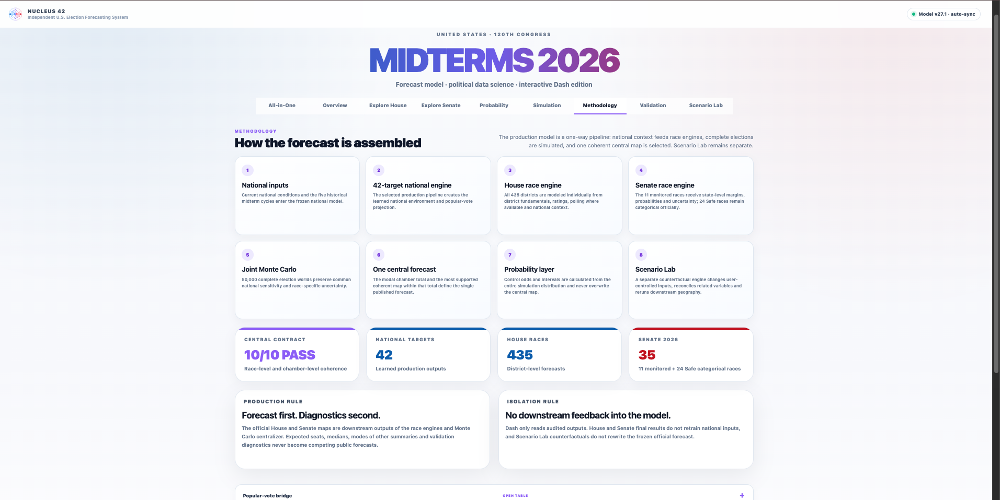</td>
</tr>
<tr>
<td align="center"><sub>Simulation · cross-variable election-world explorer</sub></td>
<td align="center"><sub>Methodology · one-way production pipeline</sub></td>
</tr>
<tr>
<td width="50%">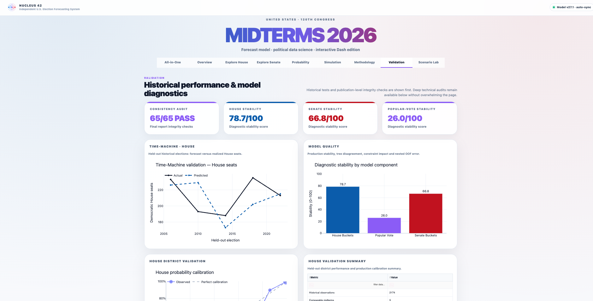</td>
<td width="50%">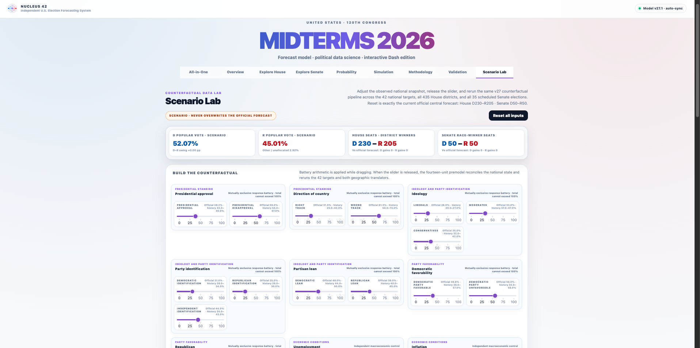</td>
</tr>
<tr>
<td align="center"><sub>Validation · historical performance and diagnostics</sub></td>
<td align="center"><sub>Scenario Lab · counterfactual national controls</sub></td>
</tr>
</table>

---

## Scenario Lab

Scenario Lab asks how the **same** forecast responds when selected national conditions change coherently.

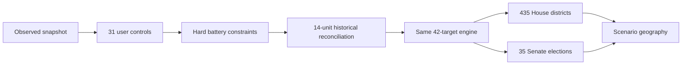

<p align="center">
  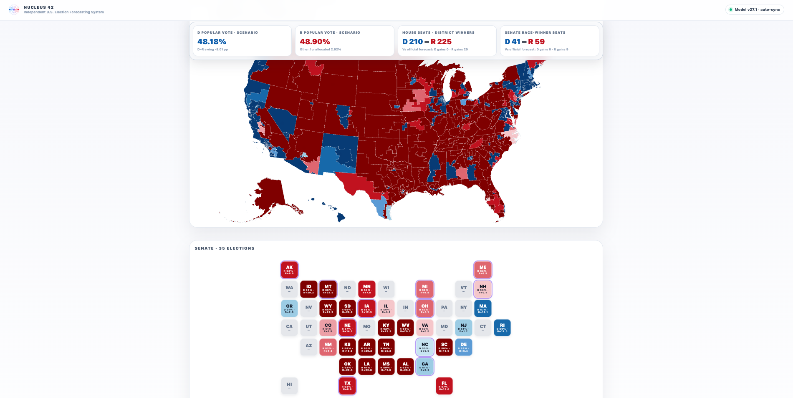
</p>

Scenario Lab is associational, not causal. See [the full contract](docs/SCENARIO_LAB.md).

---

## Historical validation

NUCLEUS 42 uses sealed modern midterms as time-machine tests:

**2006 · 2010 · 2014 · 2018 · 2022**

Model selection and tuning are nested inside each historical training set. The held-out election remains unseen until scoring. Historical OOF outputs remain diagnostics and are never promoted to production training rows.

The v27.1 release includes House OOF calibration, Senate validation, target stability, leakage checks, sensitivity audits, a **65/65 final consistency audit**, and a **10/10 central forecast contract**.

---

## Reproduce the release

### Model environment

```bash
git clone https://github.com/juaniflls/midterms-2026-forecast.git
cd midterms-2026-forecast

python3.12 -m venv .venv
source .venv/bin/activate
python -m pip install --upgrade pip
python -m pip install -r requirements.txt
python scripts/validate_repository.py
```

### Re-run the notebook

```bash
jupyter lab Modelo_Midterms_2026_v27.1_NUCLEUS42_FINAL.ipynb
```

Choose **Restart Kernel and Run All Cells**.

### Launch Dash

```bash
cd dash_app
python3.12 -m venv .venv
source .venv/bin/activate
python -m pip install --upgrade pip
python -m pip install -r requirements.txt
python check_setup.py --deep
python app.py
```

---

## Data contract

### Frozen release input
[`Model.xlsx`](Model.xlsx) is the exact workbook consumed by this release.

### Live canonical sheet
[Open the maintained Google Sheet](https://docs.google.com/spreadsheets/d/1NC80MaJh8vyxrbQsi__HSR2StaSo8mgAJ3iSdilqEj0/edit?usp=sharing)

A future release should export the maintained sheet, refresh approved current-cycle sources, execute the notebook end-to-end, validate the report/HTML/Dash contracts, and only then replace the frozen public artifacts.

See [`docs/DATA_SOURCES.md`](docs/DATA_SOURCES.md).

---

## Repository structure

```text
midterms-2026-forecast/
├── Modelo_Midterms_2026_v27.1_NUCLEUS42_FINAL.ipynb
├── Election_Model_v27_1_Coherence_Audit.html
├── Model.xlsx
├── README.md
├── MODEL_CARD.md
├── CHANGELOG.md
├── RELEASE_NOTES_v27.1.0.md
├── CITATION.cff
├── LICENSE
├── dash_app/
├── outputs/
├── assets/
├── data/
├── metadata/
├── docs/
├── qa/
├── scripts/
└── .github/
```

---

## Key methodological rules

- No future election information enters a historical training fold.
- Outer-fold predictions never become production training observations.
- National context is frozen before final House and Senate outputs.
- House and Senate are simulated race by race before chamber totals are computed.
- House and Senate Monte Carlo streams are independent.
- The central chamber total and displayed central map must agree exactly.
- Control probability comes from the full simulation distribution.
- Scenario Lab never rewrites the official forecast.
- Safe Senate structural anchors are scenario-only.
- Dash/HTML are read-only presentation layers.

---

## Limitations

- Five completed modern midterms provide limited degrees of freedom.
- Political relationships are associational and can change by cycle.
- District and state outcomes are correlated.
- House polling is sparse in many districts.
- Some Senate races remain categorical rather than numerically modeled.
- Extreme counterfactuals can leave historical support.
- Forecasts are conditional on the frozen snapshot and become stale as evidence changes.

---

## Citation

> Garbanzo Fallas, Juan Ignacio. (2026). *NUCLEUS 42: 2026 U.S. Midterm Forecast Model* (Version 27.1.0) [Computer software]. GitHub. https://github.com/juaniflls/midterms-2026-forecast

Machine-readable metadata: [`CITATION.cff`](CITATION.cff).

---

## License & independence

Code and original project documentation are released under the **MIT License**. Third-party datasets, ratings, government geography, and externally authored materials remain subject to their own terms.

**NUCLEUS 42 is an independent forecasting project.** It is not an official forecast, endorsement, or publication of any university, research center, campaign, political party, data provider, or government institution.

<p align="center">
  <strong>NUCLEUS 42</strong><br>
  <sub>Data · models · probabilities · insights · for a more informed democracy</sub><br><br>
  <sub>Same questions. Better answers.</sub>
</p>
