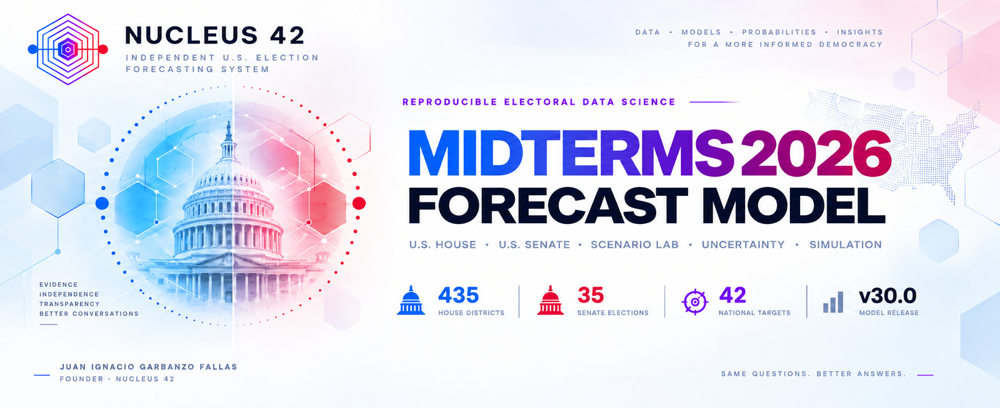
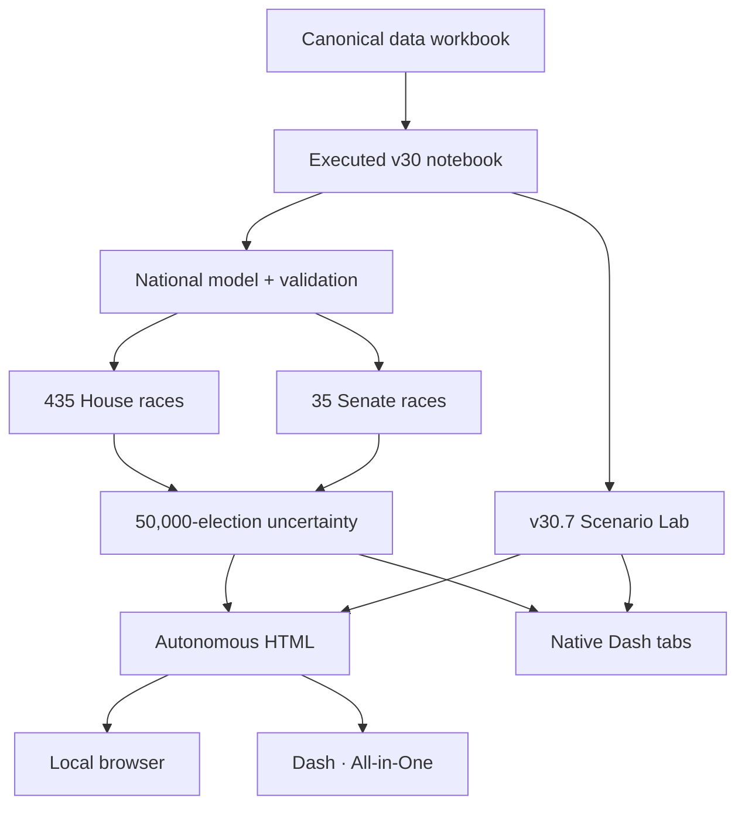
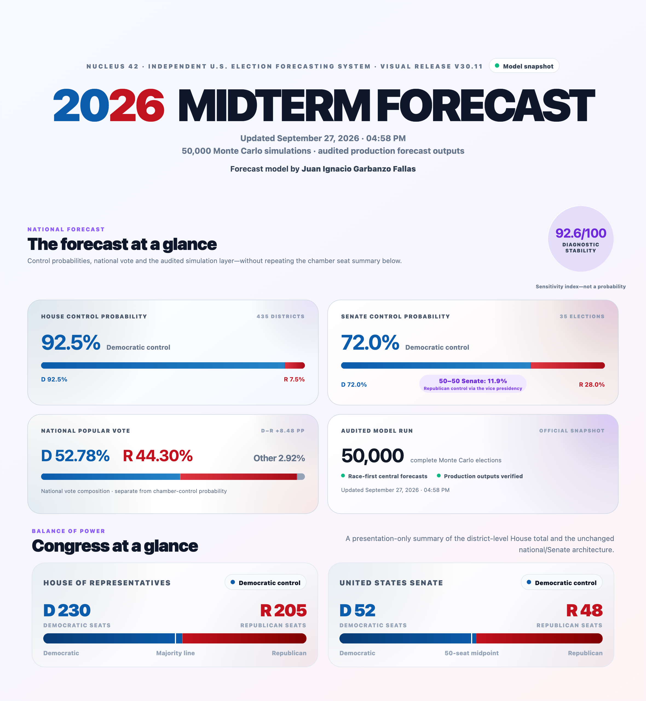
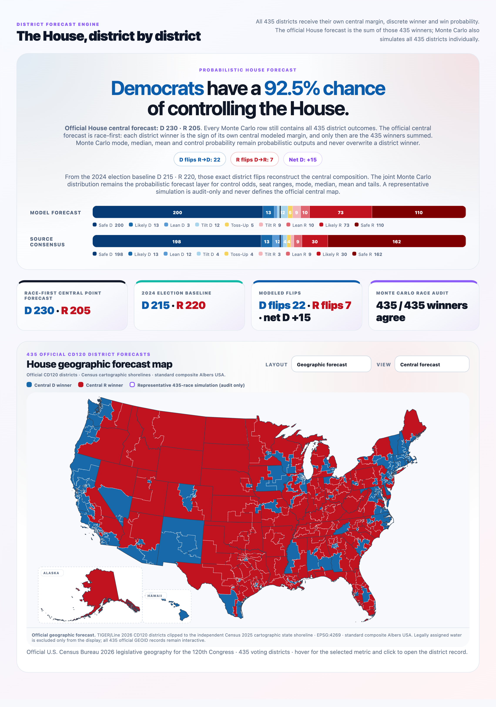
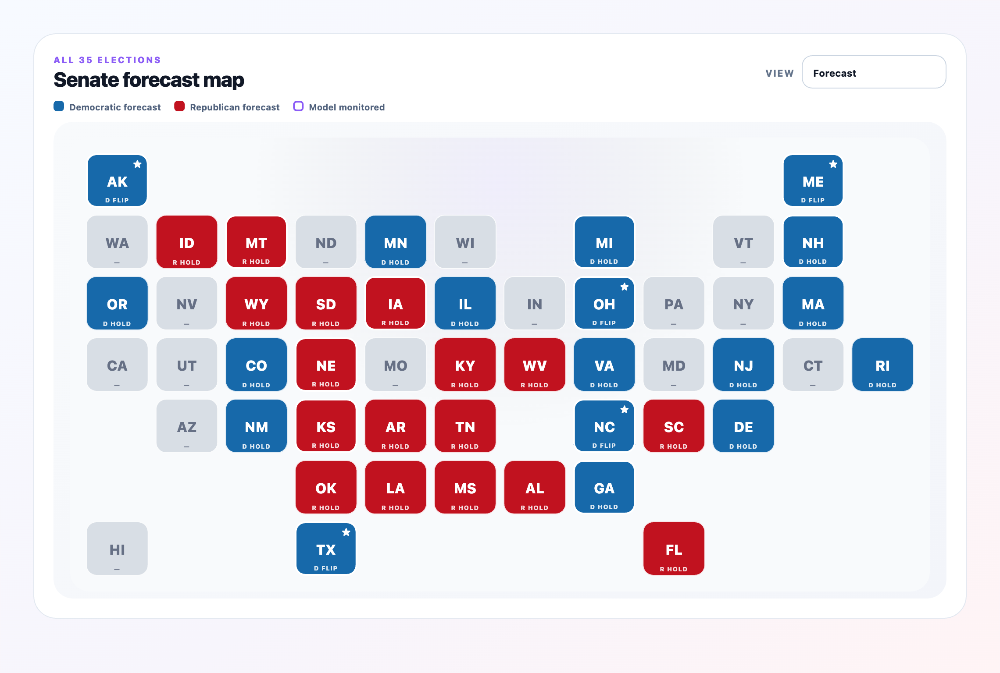
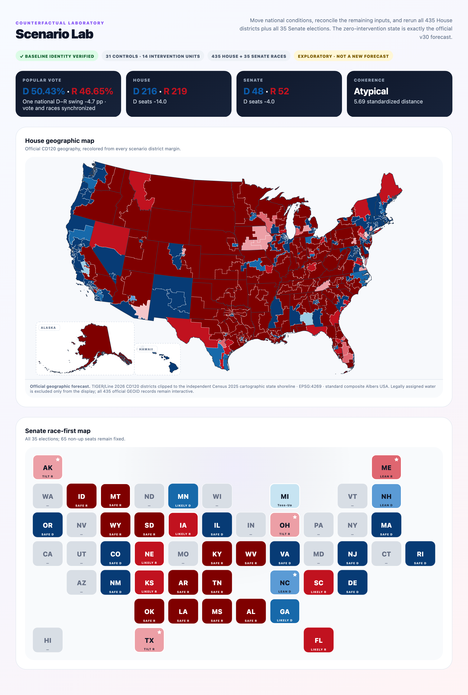

<p align="center">
  
</p>

<p align="center">
  
  
  
  
  
  
  
</p>

<h1 align="center">Nucleus 42 · 2026 U.S. Midterm Forecast</h1>

<p align="center">
  <strong>An independent, reproducible election-forecasting system.</strong><br>
  National environment · 435 House districts · 35 scheduled Senate elections · uncertainty · validation · interactive counterfactuals
</p>

<p align="center">
  Forecast model by <strong>Juan Ignacio Garbanzo Fallas</strong><br>
  <sub>Observatorio de los Estados Unidos · CIEP-UCR context · independent technical project</sub>
</p>

---

## What Nucleus 42 is

Nucleus 42 is an end-to-end political data-science system for the 2026 U.S. midterm elections. It is not only a dashboard: it connects a versioned source workbook, a reproducible modeling notebook, race-level House and Senate engines, nested historical validation, complete-election Monte Carlo simulations, structured audits, an autonomous HTML publication, and a web presentation layer.

The repository documents the model in general. Numbers visible in screenshots are examples from one executed model run; they illustrate the interface and are not hard-coded claims about future releases.

| Surface | Scope |
|---|---|
| National model | 42 targets describing vote, political context, ideology, partisanship, approval, and economic perceptions |
| U.S. House | Every voting district, with race-first margins, winners, ratings, probabilities, holds, flips, geographic map, and cartogram |
| U.S. Senate | All 35 scheduled 2026 elections, including monitored and structural races under one 35-race architecture |
| Uncertainty | 50,000 complete simulated elections and chamber-control distributions |
| Scenario Lab | 31 controls in 14 intervention units, constrained reconciliation, incumbent-aware effects, and race-first geography |
| Publication | One autonomous HTML used locally and by the Render application |

## Start here

| Resource | Purpose |
|---|---|
| [Executed v30.11 notebook](NUCLEUS42_v30_11_FINAL_PUBLICATION_RELEASE.ipynb) | Complete production pipeline with stored outputs |
| [Autonomous forecast HTML](Election_Model_v30_11_Final_Publication.html) | Self-contained interactive publication; no server required |
| [Canonical input workbook](Model.xlsx) | Versioned source snapshot for the included model run |
| [v30 consolidated report](outputs/Election_Model_Final_Report_v30.xlsx) | Structured outputs, contracts, audits, and race detail |
| [Render application](dash_app/) | Native analytical tabs plus the canonical All-in-One publication |
| [Methodology](docs/METHODOLOGY.md) | Model architecture, validation, uncertainty, and contracts |
| [Scenario Lab guide](docs/SCENARIO_LAB.md) | Counterfactual engine, constraints, interpretation, and limits |
| [Model card](MODEL_CARD.md) | Intended uses, non-uses, validation, and limitations |
| [Publishing guide](docs/PUBLISHING.md) | Validation, GitHub, social preview, and release workflow |

> [!IMPORTANT]
> `Model.xlsx`, the executed notebook, `outputs/Election_Model_Final_Report_v30.xlsx`, and the autonomous HTML form one release snapshot. Update them together by running the notebook end to end.

## One release contract, two coordinated surfaces

The notebook generates the authoritative report and autonomous HTML. The Render application preserves its native analytical tabs while the **All-in-One** tab embeds that exact HTML. Its independent **Scenario Lab** tab reads the serialized v30.7 contract from the same publication, so it does not fall back to the old v27 engine.


```mermaid
flowchart TD
    A["Canonical data workbook"] --> B["Executed v30 notebook"]
    B --> C["National model + validation"]
    C --> D["435 House races"]
    C --> E["35 Senate races"]
    D --> F["50,000-election uncertainty"]
    E --> F
    B --> G["v30.7 Scenario Lab"]
    F --> H["Autonomous HTML"]
    G --> H
    H --> I["Local browser"]
    H --> J["Dash · All-in-One"]
    F --> K["Native Dash tabs"]
    G --> K
```

This design keeps the publication coherent without removing the richer Dash navigation:

- **All-in-One** is the exact autonomous HTML;
- Overview, Explore House, Explore Senate, Probability, Simulation, Methodology, and Validation remain native Dash views sourced from the v30 report;
- the native Scenario Lab loads the same `v30.7-directed-causal-race-first` payload as the HTML;
- reset returns to the exact official race-first baseline;
- House and Senate maps, hovers, tables, filters, and data exploration remain available in their dedicated views;
- Dash never rewrites the workbook, notebook, report, or forecast.

## Product tour

### Forecast overview

<p align="center">
  
</p>

The Overview brings together chamber-control probability, national popular vote, simulation status, and balance of power without duplicating the full race desks.

### House: race-first, district by district

<p align="center">
  
</p>

Every House total is reconstructed from 435 individual district winners. Users can switch among the geographic map and district cartogram, inspect margins and probabilities, identify holds and flips, filter the race desk, and export visible data.

### Senate: one 35-race architecture

<p align="center">
  
</p>

The Senate layer covers every scheduled election. Monitored races can use the validated polling engine selected by out-of-fold evidence; the remaining races use structural estimates. The chamber total is the sum of race winners plus fixed non-up seats—never a chamber quota.

### Scenario Lab

<p align="center">
  
</p>

The Scenario Lab is exploratory, not a replacement forecast. It moves national conditions through a directed, historically scaled system and then reruns all 435 House districts and all 35 Senate elections. Composition batteries remain coherent, protected exogenous inputs do not receive reverse feedback, and economic/political conditions are interpreted relative to the presidential incumbent party.

> [!NOTE]
> Interface images are publication examples from an executed snapshot. The methodology and functionality are the durable subject of this repository.

## Modeling principles

1. **Race first.** Chamber totals are consequences of race-level winners.
2. **No chamber quota.** House and Senate outputs are never forced to a desired seat total.
3. **Temporal validation.** Historical cycles are held out as sealed future elections during model evaluation.
4. **Probability discipline.** Point forecasts, win probabilities, control probabilities, and diagnostic stability are distinct quantities.
5. **Module isolation.** Senate cannot rewrite the national vote; the presentation layer cannot rewrite the model.
6. **Traceable fallbacks.** Missing or weak evidence triggers explicit, auditable behavior rather than silent substitution.
7. **Reproducible publication.** The report and HTML are generated downstream of successful release gates.

## Run the autonomous publication

No installation is required:

1. Download or clone the repository.
2. Open `Election_Model_v30_11_Final_Publication.html` in a modern browser.

The file contains its own styles, data, maps, tables, Scenario Lab, and export logic.

## Run the Render/Dash application locally

```bash
python -m venv .venv
source .venv/bin/activate
pip install -r dash_app/requirements.txt
python dash_app/check_setup.py
python dash_app/app.py
```

Open `http://127.0.0.1:8050`. **All-in-One** automatically selects the newest file matching `Election_Model*.html`; the other tabs remain native Dash views of the same v30 report.

## Reproduce the model

```bash
python -m venv .venv
source .venv/bin/activate
pip install -r requirements.txt
jupyter lab NUCLEUS42_v30_11_FINAL_PUBLICATION_RELEASE.ipynb
```

Place the intended canonical workbook at `Model.xlsx`, restart the kernel, and run every cell in order. Do not publish partial execution state. The release gate after HTML generation must pass.

Run repository checks:

```bash
python scripts/validate_repository.py
python dash_app/check_setup.py
```

## Repository map

```text
.
├── NUCLEUS42_v30_11_FINAL_PUBLICATION_RELEASE.ipynb
├── Election_Model_v30_11_Final_Publication.html
├── Model.xlsx
├── outputs/
│   ├── Election_Model_Final_Report_v30.xlsx
│   └── generated model and audit artifacts
├── dash_app/
│   ├── app.py
│   ├── assets/dash_v2.css
│   └── check_setup.py
├── assets/
│   ├── branding/
│   ├── readme/
│   └── social/
├── docs/
├── scripts/
├── render.yaml
└── VERSION
```

## Data and update policy

The maintained Google Sheet is the live editorial source; `Model.xlsx` is the release snapshot. A workbook edit is not a published forecast until the notebook completes, all contracts pass, and the report and HTML are regenerated.

[Open the maintained source sheet](https://docs.google.com/spreadsheets/d/1NC80MaJh8vyxrbQsi__HSR2StaSo8mgAJ3iSdilqEj0/edit?usp=sharing)

See [Data Sources](docs/DATA_SOURCES.md) for source roles and refresh rules.

## Interpretation and limitations

- This is a probabilistic forecast, not a statement of certainty.
- Scenario Lab outputs are counterfactual stress tests, not new official forecasts.
- Candidate changes, redistricting, polling errors, turnout, source revisions, and rare shocks can alter outcomes.
- The national popular-vote model is an independently validated module; displayed national vote is not mechanically reconstructed from chamber seat totals.
- Diagnostic stability is a sensitivity index, not a win probability.
- Historical relationships may not persist under structural political change.

## Citation, license, and conduct

- Citation metadata: [CITATION.cff](CITATION.cff)
- Model card: [MODEL_CARD.md](MODEL_CARD.md)
- Contribution guide: [CONTRIBUTING.md](CONTRIBUTING.md)
- Security policy: [SECURITY.md](SECURITY.md)
- License: [MIT](LICENSE)

Nucleus 42 is an independent technical project. Institutional context must not be interpreted as formal endorsement unless expressly stated.
